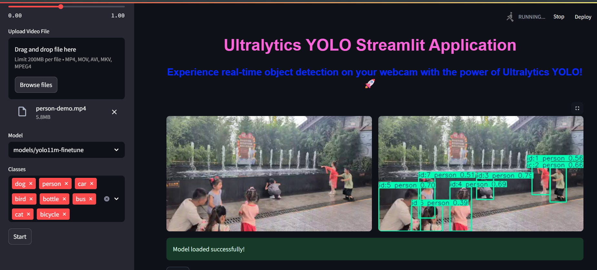
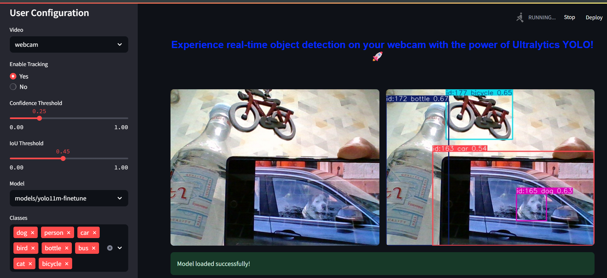
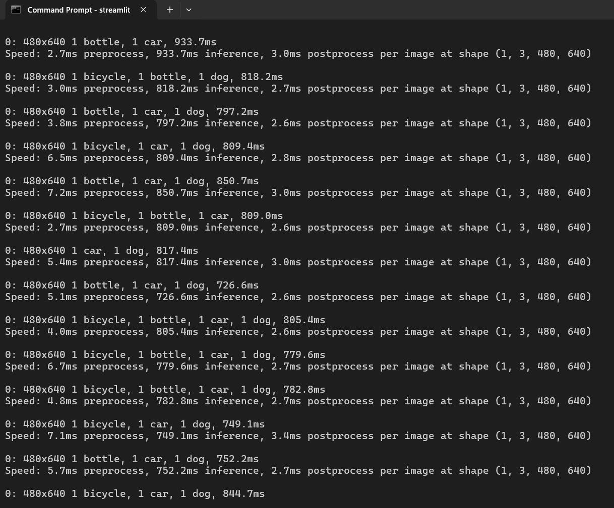

# Streamlit Webcam and Video Demo

This part explains how to set up, run, and troubleshoot the Streamlit-based webcam application.

---

## 1. Prerequisites

**Python 3.7+** installed and added to your `PATH`. 


You can create and activate a virtual environment or Conda environment 
to isolate dependencies. Or you can just use it locally. 
In the next steps only local setup is presented.

---

## 2. Environment Setup

1. Clone and navigate to [YOLOv11-Obj-Det-PascalVOC](../) directory

2. Upgrade pip and install dependencies:

   ```bash
   pip install --upgrade pip
   pip install ultralytics streamlit
   ```

---

## 3. Running the App

1. In the CLI navigate to the folder containing `webcam-script.py`. (You can change the path to the model in the script if needed).

2. **Run Streamlit**:

   ```powershell
   streamlit run webcam-script.py
   ```
3. **Open browser** after the execution, with the shown URL (usually `http://localhost:8501`).

> `missing ScriptRunContext` *warning might show, which can be ignored.*

---
## 4. Model Selection & other configs

After opening the Streamlit interface, 
the first step is to select preferred model file (`.pt`) from local machine. 
By default, will be chosen the model, which was referenced in the
webcam-script.py before running. For using another model,
simply change the model path in the webcam-script.py before running.

As mentioned in [Ultralytics](https://docs.ultralytics.com/modes/export/#introduction), 
we can gain up to 5x GPU speedup with TensorRT and 3x CPU speedup with ONNX.
All the details about each model are shown at the end of [notebook](../YOLOv11-obj-det-PascalVOC.ipynb).
In the [models](models/) directory different formats are available, 
but here only the use of `.pt` files is shown. Streamlit doesn't support 
model inference with other file **via this method**, so further research is needed to inference models with `.onnx`, `.engine` extention.


In the left sidebar there are configuration options:

- **Input source**: choose between video file or webcam stream.  
- **Tracking**
- **Confidence and IoU Thresholds**
- **Model selection**
- **Classes selection**

After uploading the model and setting your preferences, 
click **Start** in the bottom-left corner to start inference.

To avoid any problems while modifying configs, click **Stop** in the upper-right corner or under the video, select new configs, then click **Start** again.

### Video mode


> Done with yolo11m-finetune.pt model

### Webcam mode


> Done with yolo11m-finetune.pt model


### Inside the CLI

## 5. Stopping the App
* In the terminal where Streamlit is running, press **Ctrl + C** to stop the server.
* Alternatively, close the terminal window.

---
